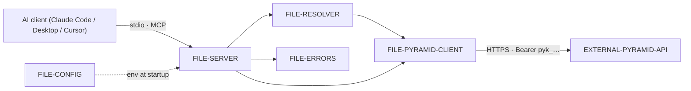

# System overview

Conceptual map: an AI client speaks MCP over stdio to the server, which resolves names to
IDs (cached), then calls the fixed Pyramid HTTP API as the key's user. The MCP holds no
state of its own.

Names resolve through [[FILE-RESOLVER]] before any call; every response is hydrated and
every error normalized to [[DATATYPE-MCP-ERROR]].
